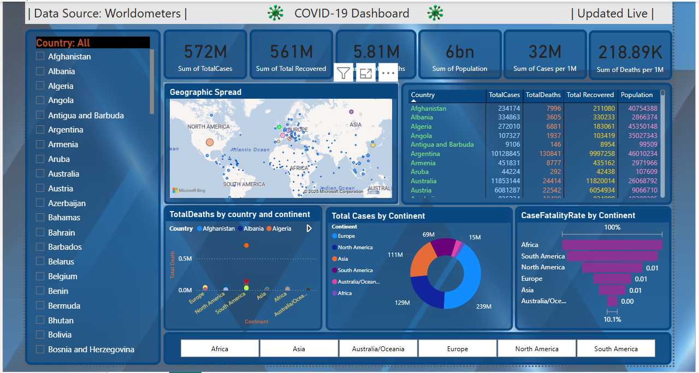

# 🌍 COVID-19 Global Dashboard (Power BI)

This is an interactive **Power BI dashboard** built using **live COVID-19 data** from [Worldometers](https://www.worldometers.info/coronavirus/). It showcases real-time pandemic statistics with professional visuals, filters, and insights.

---

## 📊 Key Features:

- 🔄 **Live Web Data Connection** from Worldometers
- 📌 **Top KPIs**: Total Cases, Recovered, Deaths, Population, Cases/1M
- 🗺️ **Geographic Spread Map** with bubble indicators
- 🧮 **Total Deaths by Country & Continent** (Scatter Chart)
- 📈 **Case Fatality Rate by Continent** (Bar Chart)
- 🧭 **Donut Chart** for Total Cases by Continent
- 📋 **Interactive Country & Continent Filters**
- 🎨 Stylish theme with clean layout and responsive visuals

---

## 🛠 Tools & Technologies:

| Tool            | Purpose                         |
|-----------------|----------------------------------|
| Power BI Desktop| Dashboard development            |
| Power Query     | Data cleaning & transformation   |
| Web Connector   | Live data import from HTML table |
| Bing Maps       | Geographic data visualization    |
| Conditional Formatting | Enhanced table styling     |

---

## 📁 Dataset Source:

- 🌐 **Website**: [https://www.worldometers.info/coronavirus/](https://www.worldometers.info/coronavirus/)
- 📝 **Data Format**: Extracted from live HTML tables using Power BI’s **Web → Table Connector**
- 📌 Columns Used:  
  - `Country`, `TotalCases`, `TotalDeaths`, `TotalRecovered`, `Population`, `Continent`, `Cases per 1M`, `Deaths per 1M`

---

## 🧪 Calculated Measures (DAX):

Metrics are calculated inside Power BI:
- **Case Fatality Rate (CFR)** = `(TotalDeaths / TotalCases) * 100`

---

## 📸 Dashboard Preview:

> Below is a screenshot of the final Power BI Dashboard 👇

---

## 📥 Download PBIX:

You can explore the dashboard by downloading the Power BI file:

📂 [COVID19_Global_Dashboard.pbix](./COVID19_Global_Dashboard.pbix)

---

## 💡 Future Enhancements (Optional):
- Add country flags using ISO image links  
- Add time-series line chart for new cases  
- Create tooltip pages with detailed stats  
- Publish report to Power BI Service or embed in web page

---

## 👩‍💻 Created By:

**Pooja Choudhary**  
🎓 BCA (Data Science) | 2023–2026  
📍 Sri Balaji University, Pune  
🌐 [GitHub Profile](https://github.com/PoojaChoudhary-01)

---

> ✅ This dashboard is built for educational, analytical, and portfolio purposes only.  
> 📌 Data used is publicly available and updated live from the Worldometers source.

